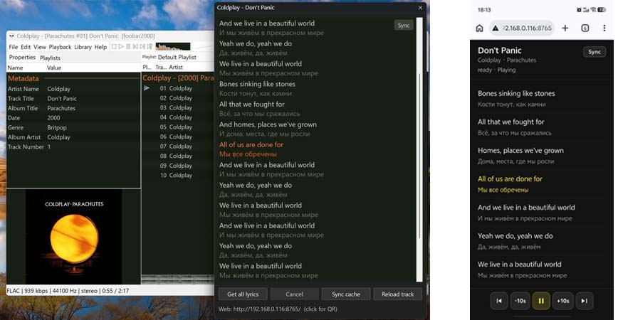

# Lyrics AI Translator

A **foobar2000 v2** component (**32-bit and 64-bit**) that fetches song lyrics (lrclib.net), translates them into the user’s language, and displays original + interlinear translation in a plugin window or on another device on the local network (TV, phone, tablet). Remote playback control (pause / seek) is supported. On subsequent plays, lyrics and translations are loaded from the local cache.

## Features

- Lyrics window with synced-line highlight (when timestamps are present)
- Lyrics fetch and translation via an OpenAI-compatible LLM API
- Optional proxy routing for LLM and LRCLib (**SOCKS5** or **HTTP CONNECT**; enabled by default in the example config)
- Launch and configuration through foobar2000’s native menus
- Local JSON cache; optional Git sync (GitHub/GitLab + PAT)
- Web remote: display on another device and control the player from a phone
- Settings in foobar2000 Preferences (Language / LLM / Proxy / Cache / Web)

## Quick start (end users)

1. Install **foobar2000 v2** (x86 or x64 — use the matching plugin package).
2. **Preferences → Components → Install…** → `foo_lyrics_ai_translator_win32.fb2k-component` or `_win64` (see [docs/USER_EN.md](docs/USER_EN.md)).
3. Restart foobar; set the LLM API key in Preferences (or in `config.json`). If you hit regional network restrictions, configure a proxy.
4. **View → Lyrics AI Translator → Open lyrics window**.

Full guide: **[docs/USER_EN.md](docs/USER_EN.md)**.

## Developers

Building the DLL plus Go worker/server, dependencies (SDK, WTL, VS, Go), and architecture:

**[docs/DEV_EN.md](docs/DEV_EN.md)**

In short: place the foobar2000 SDK next to this repository (`../SDK-2025-03-07/`), install WTL 10, VS Build Tools (x86 + x64), and Go. Then run `build-release.bat all` and `.\scripts\package-release.ps1 -Arch all`.

## Repository layout

| Path | Purpose |
|------|---------|
| `plugin/` | foobar2000 C++ component (`foo_lyrics_ai_translator.dll`) |
| `worker/` | Go: lrclib + LLM → JSON cache |
| `lyrics_server/` | Go: LAN web UI |
| `config.example.json` | Sample settings (no secrets) |
| `docs/` | Documentation |

## Requirements

- foobar2000 **v2.x** — package **must match** foobar bitness (x86 or x64)
- For translation: access to an OpenAI-compatible API (and SOCKS5 / HTTP proxy if needed)
- For Git sync: `git` installed
- For web: `lyrics_server.exe` next to the DLL; the lyrics window should be open

## Disclaimer

Lyrics are requested from https://lrclib.net, a third-party service. This project’s author cannot guarantee its availability or that your track exists in its database. From some regions, enabling and configuring a proxy may be required.

API keys, PATs, and passwords are stored locally in `config.json` — **do not publish** that file. LLM and third-party services may incur separate charges.
